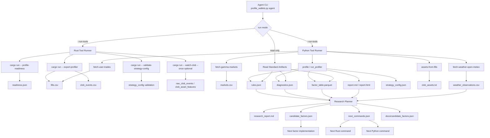
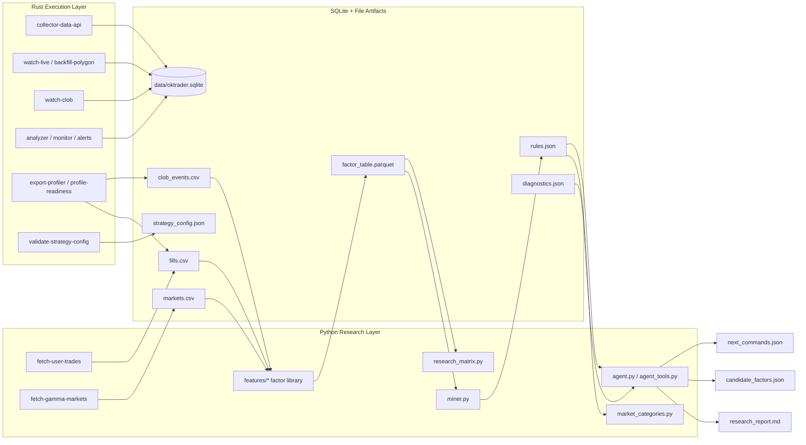

# OKTRADER Alpha

Rust + Python toolkit for cross-market Polymarket smart-money mining,
strategy reverse engineering, and live tracking.

OKTRADER uses a dual-engine architecture:

- Rust is the execution layer for long-running collectors, SQLite storage,
  on-chain/CLOB ingestion, account scoring, alerting, and strategy validation.
- Python is the research layer for feature mining, market-category playbooks,
  profiler reports, and the deterministic Agent CLI.
- SQLite, CSV, Parquet, JSON, and Markdown are the handoff artifacts between
  the two engines.

## PolyEdge Platform Direction

The project is evolving from a scanner/profiler into an Alpha Research Agent
platform:

```text
Data Layer
  -> Wallet Intelligence
  -> Strategy Reverse Engineering
  -> Factor Research
  -> Validation
  -> Strategy Signals
  -> Agent Orchestration
```

The durable product loop is: find smart wallets, explain why they make money,
turn repeatable behavior into factors, validate those factors against negative
controls and walk-forward samples, then promote approved factors into live
strategy signals. See `docs/polyedge_architecture.md`.

Check the current research-platform surface:

```bash
cargo run -- research-status --db data/oktrader.sqlite
cargo run -- build-wallet-intelligence --db data/oktrader.sqlite
cargo run -- validate-strategy-config \
  --input data/profiler/strategy_config.json \
  --db data/oktrader.sqlite
```

## Architecture

```text
                    Polymarket Data API
                           |
                           v
                 Rust collector-data-api
                           |
Polygon RPC/WSS ---> Rust watch-live/backfill-polygon
                           |
Polymarket CLOB WS -> Rust watch-clob -> build-microstructure
                           |
                           v
                  SQLite data/oktrader.sqlite
                           |
          +----------------+----------------+
          |                                 |
          v                                 v
 Rust analyzer/monitor/alerts       Rust export-profiler
          |                                 |
          v                                 v
 matched_accounts / alerts     fills.csv + clob_events.csv
                                            |
                                  Python fetch-gamma/news
                                            |
                                            v
                                   Python profiler
                                            |
                +---------------------------+--------------------------+
                |                           |                          |
                v                           v                          v
        factor_table.parquet            rules.json              diagnostics.json
                |                           |                          |
                +---------------------------+--------------------------+
                                            |
                                            v
                                   Agent CLI orchestrator
                                            |
        +----------------+------------------+-------------------+
        |                |                  |                   |
        v                v                  v                   v
 research_report.md candidate_factors.json next_commands.json strategy_config.json
        |                |                  |                   |
        v                v                  v                   v
 human review     factor backlog    next Rust/Python run   Rust validate/alerts
```

The intended agent loop is:

```text
wallet/profile request
  -> Rust profile-readiness
  -> Rust export-profiler
  -> Python remote trade fallback if local fills are empty
  -> Python Gamma metadata fetch
  -> Python profiler and factor mining
  -> Rust validate-strategy-config
  -> Agent research_report + candidate_factors + next_commands
  -> next data/factor collection cycle
```

## Research SOP

OKTRADER is not only a scanner; it is a repeatable research system. The SOP is
kept in two forms:

- Human playbook: `docs/research_sop.md`
- Agent-readable workflow: `config/agent_sop.json`

Every Agent run writes `sop_status.json` into the profile directory. That file
marks each stage as `done`, `blocked`, or `pending`, so a wallet study can be
resumed without guessing what is missing.

The standard loop is:

```text
resolve user/wallet
  -> acquire fills + metadata
  -> run readiness gate
  -> build factor_table
  -> mine rules and classify playbook
  -> write research_report
  -> propose candidate_factors
  -> run next_commands
  -> promote proven factors into profiler/okprofiler/features
```

## Agent Tool Graph





## Implementation Status

| Area | Status |
| --- | --- |
| Rust SQLite schema, collectors, analyzer, monitor, alerts | Implemented |
| Recent public trade ingestion via Data API | Implemented |
| Polygon RPC backfill/live scanner foundation | Implemented, requires real RPC |
| CLOB websocket recorder and microstructure builder | Implemented for live/recorded data |
| Python profiler, factor table, reports, rules, strategy config | Implemented |
| Factor library structure and weather market playbook | Implemented |
| Agent CLI reading artifacts and writing research outputs | Implemented |
| Agent CLI orchestrating Rust + Python tools | Implemented |
| Agent `next_commands.json` planner and candidate factor backlog | Implemented |
| Open-Meteo archive fetch entrypoint | Implemented as data adapter |
| Weather observation factors in `factor_table` | Implemented for actual daily high |
| Weather forecast history adapter and forecast factors in `factor_table` | Implemented |
| Full audit-grade realized PnL from settlement/redemption events | In progress/future hardening |
| Automatic trading/execution | Not enabled; alert/strategy validation only |

The project has several Rust production roles:

- `collector-data-api`: continuously collects recent public Polymarket trades.
- `watch-live`: continuously polls Polygon settlement logs for verified fills.
- `watch-clob`: continuously archives selected CLOB market websocket events.
- `analyzer`: continuously computes wallet features and account classifications.
- `monitor`: continuously watches the classified smart-money pool.

SQLite is the default local database at `data/oktrader.sqlite`; JSON/CSV files are exports and compatibility paths, not the long-term primary store.

## Quick Start

```bash
cargo run -- init-db --db data/oktrader.sqlite

cargo run -- collector-data-api \
  --db data/oktrader.sqlite \
  --interval-secs 30

cargo run -- analyzer \
  --db data/oktrader.sqlite \
  --tier candidate-smart-money \
  --tier core-smart-money \
  --tag stable-alpha-wallet \
  --tag information-edge-wallet \
  --interval-secs 60

cargo run -- monitor --db data/oktrader.sqlite --interval-secs 10
```

Polygon settlement live scanner:

```bash
cargo run -- watch-live \
  --db data/oktrader.sqlite \
  --rpc-url "$POLYGON_RPC_URL" \
  --include-neg-risk
```

CLOB microstructure scanner for a token pool:

```bash
cargo run -- watch-clob \
  --db data/oktrader.sqlite \
  --assets-file data/clob_assets.txt \
  --reconnect-min-secs 2 \
  --reconnect-max-secs 60
```

Build wallet-level CLOB timing features after you have both fills and CLOB events:

```bash
cargo run -- build-microstructure \
  --db data/oktrader.sqlite \
  --pre-secs 60 \
  --post-secs 30
```

One-shot local smoke test:

```bash
cargo run -- init-db --db data/oktrader.sqlite
cargo run -- collector-data-api --db data/oktrader.sqlite --once --page-size 100 --max-offset 0
cargo run -- analyzer --db data/oktrader.sqlite --once --tag small-sample-noise
cargo run -- monitor --db data/oktrader.sqlite --once
```

Watch new fills as alerts:

```bash
cargo run -- alerts --db data/oktrader.sqlite
```

By default `alerts` only prints fills from wallets currently in `matched_accounts`. To debug all new fills:

```bash
cargo run -- alerts --db data/oktrader.sqlite --all-wallets
```

Import known smart-money wallets:

```bash
cargo run -- import-watchlist \
  --db data/oktrader.sqlite \
  --input data/watchlist_wallets.txt \
  --source manual
```

`data/watchlist_wallets.txt` format:

```text
0xabc...,insider_candidate
0xdef...,market_maker_candidate
```

Watch only known watchlist fills:

```bash
cargo run -- alerts --db data/oktrader.sqlite --watchlist
```

Send alert messages to a webhook:

```bash
cargo run -- alerts --db data/oktrader.sqlite --watchlist --webhook-url "$WEBHOOK_URL"
```

## VPS Overnight Run

For a real overnight run, use the release binary and background scripts:

```bash
cp .env.example .env
python scripts/build_release.py
python scripts/run_vps_stack.py
python scripts/status.py
```

Logs are written to `logs/*.log`, and process ids are written to `run/*.pid`.

Stop everything:

```bash
python scripts/stop_vps_stack.py
```

If you have a real Polygon RPC URL, edit `.env`:

```text
POLYGON_RPC_URL=https://polygon-mainnet.g.alchemy.com/v2/real_key
OKTRADER_ENABLE_RPC=1
```

Then rerun `python scripts/run_vps_stack.py`. Without RPC, the stack still runs Data API collection, analyzer, alerts, and summary.

See the full tier/tag distribution:

```bash
cargo run -- summary --db data/oktrader.sqlite
```

Account type rules are configurable:

```text
config/account_types/*.json
```

Each JSON file defines one wallet profile such as stable alpha, information edge, market-making/stat-arb, or swing trading. To add a new smart-money type, add another file with an `id`, `family`, `tier`, optional known `tag`, and metric threshold `rules`.

## Python Profiler

Export known wallets and raw CLOB events for offline reverse engineering:

Before profiling, run the readiness gate:

```bash
cargo run -- profile-readiness \
  --db data/oktrader.sqlite \
  --wallet-pool data/watchlist_wallets.txt
```

The readiness gate checks trades, distinct markets, closed markets, and CLOB
as-of alignment. A wallet is not considered reverse-engineerable until this
gate passes.

Basic one-wallet workflow:

```bash
python scripts/profile_wallet.py 0xYourWallet data/oktrader.sqlite
```

This writes `data/profiler/readiness.json`, `diagnostics.json`, `rules.json`,
`factor_table.parquet`, `factor_summary.md`, `factor_research_log.md`,
`report.md`, `report.html`, and `strategy_config.json`.
If the wallet lacks CLOB alignment or metadata, inspect `diagnostics.json`; it
will tell you which collection step is missing.

```bash
cargo run -- export-profiler \
  --db data/oktrader.sqlite \
  --wallet-pool data/watchlist_wallets.txt
```

Run the Python profiler:

```bash
python3 -m venv .venv
. .venv/bin/activate
pip install -r profiler/requirements.txt
python profiler/profile_wallets.py \
  --fills data/profiler/fills.csv \
  --clob data/profiler/clob_events.csv \
  --news data/profiler/news.csv \
  --out data/profiler/rules.json \
  --factor-out data/profiler/factor_table.parquet \
  --strategy-out data/profiler/strategy_config.json \
  --report-out data/profiler/report.md \
  --html-out data/profiler/report.html \
  --research-engines core,alphalens,shap,stumpy,agent
```

You can also use explicit subcommands:

```bash
python profiler/profile_wallets.py fetch-gamma-markets \
  --out data/profiler/markets.csv \
  --limit 500 \
  --max-offset 5000

python profiler/profile_wallets.py fetch-news-rss \
  --url "https://example.com/feed.xml" \
  --out data/profiler/news.csv

python profiler/profile_wallets.py fetch-user-trades \
  --wallet 0xYourWallet \
  --out data/profiler/fills.csv

python profiler/profile_wallets.py resolve-user @beefslayer

python profiler/profile_wallets.py research-user @beefslayer \
  --db data/oktrader.sqlite \
  --update-candidates

python profiler/profile_wallets.py assets-from-fills \
  --fills data/profiler/fills.csv \
  --out data/profiler/clob_assets.txt

python profiler/profile_wallets.py profile \
  --fills data/profiler/fills.csv \
  --clob data/profiler/clob_events.csv \
  --markets data/profiler/markets.csv \
  --diagnostics-out data/profiler/diagnostics.json
```

The profiler is a separate Python research package under `profiler/okprofiler/`.
It does an as-of join from wallet fills to previous CLOB events, can optionally
join an external news timeline or a market metadata CSV with `resolution_time`,
extracts spread, OFI, depth imbalance, price momentum, and time-to-resolution
features, and emits human-readable per-wallet threshold rules, a Parquet factor
table, a reproducibility/coverage report, and a Rust-readable strategy config.

Factor mining is split into small modules:

```text
profiler/okprofiler/factor_library.py   candidate factor registry
profiler/okprofiler/data_sources.py     Gamma metadata fetcher
profiler/okprofiler/diagnostics.py      source/factor readiness diagnostics
profiler/okprofiler/features/           concrete feature extraction package
docs/factors.md                         human-maintained factor catalog
profiler/okprofiler/miner.py            single/pair factor search and scoring
profiler/okprofiler/research/           research-engine package entrypoints
profiler/okprofiler/researcher.py       agent-style interpretation and next experiments
profiler/okprofiler/strategy.py         live-compatible strategy export
profiler/okprofiler/research_matrix.py  professional research-engine matrix
```

Add a new Python factor in four places:

1. Implement extraction in `profiler/okprofiler/features/*.py`.
2. Wire it through `profiler/okprofiler/features/derived.py`.
3. Register the column, label, direction, quantile, and source requirements in `profiler/okprofiler/features/registry.py`.
4. Document it in `docs/factors.md`.

Per-run evidence is written to `factor_summary.md`, `factor_research_log.md`,
and `rules.json`. A factor should only be promoted when it has non-null rows,
an interpretable rule, and a clear note on whether Rust can evaluate it live.

Market-specific playbooks live under `docs/market_categories/`. The first
production playbook is `docs/market_categories/weather.md`; profiler runs
automatically attach it when a wallet's `weather_market_ratio` indicates a
weather-temperature specialist.

`rules.json` keeps both `best_rule` for offline explanation and
`best_live_rule` for monitor-compatible alerts. This matters because some
strong research factors, such as distance to BBO, may not yet exist in Rust's
real-time feature snapshot.

The research matrix keeps professional engines behind explicit adapters. Core
runtime stays light, while `rules.json` can include Alphalens-like IC evidence,
SHAP-compatible model importance, STUMPY-style motif search, a Nautilus replay
manifest, and agent suggestions. Heavy packages can be installed separately:

```bash
pip install -r profiler/requirements-optional.txt
```

`diagnostics.json` is the first file to inspect when a wallet cannot be
reverse-engineered. It reports which raw sources are missing, which factors have
zero non-null rows, and the next collection action such as running `watch-clob`
or fetching Gamma markets.

To start collecting CLOB for a wallet's traded assets:

```bash
python scripts/watch_wallet_clob.py 0xYourWallet data/oktrader.sqlite
```

This first profiles the wallet, writes `clob_assets.txt`, then starts
`watch-clob`. Historical CLOB that was never recorded cannot be reconstructed
from this websocket; this records live evidence from now onward.

Validate the generated strategy config before using it in monitoring:

```bash
cargo run -- validate-strategy-config \
  --input data/profiler/strategy_config.json \
  --db data/oktrader.sqlite
```

The `--db` flag is optional; when supplied, validated strategy definitions are
persisted into the `strategies` table. Live alert triggers created with
`--strategy-config` are persisted into `signals`.

Python profiler runs also emit `wallet_clusters.json` and
`factor_validations.json`. When the agent runs with a database, wallet clusters
are persisted into `wallet_clusters`, and validation verdicts advance
`factor_candidates` through the candidate/validating/approved/rejected/decayed
lifecycle.

Use the generated strategy rules in live alerts:

```bash
cargo run -- alerts \
  --db data/oktrader.sqlite \
  --watchlist \
  --strategy-config data/profiler/strategy_config.json \
  --interval-secs 5
```

Generated strategies are disabled by default. Enable only the strategies you
have reviewed in `strategy_config.json`; monitor runs in alert-only mode.

Run the local research agent over a completed profile:

```bash
OKTRADER_PROFILE_DIR=data/profiler_beefslayer python scripts/agent_research.py
```

This reads `rules.json` and `diagnostics.json`, then writes
`research_report.md` and `candidate_factors.json`. To force a fresh Python
profiling pass before the agent reads the artifacts:

```bash
OKTRADER_PROFILE_DIR=data/profiler_beefslayer python scripts/agent_research.py --rerun-profile
```

The agent is deterministic: it consumes profiler artifacts, market-category
playbooks, and candidate factor lists. It does not invent evidence; it records
missing data and the next factors to implement or collect.

Run the full Rust + Python agent tool loop for a wallet:

```bash
OKTRADER_PROFILE_DIR=data/profiler_beefslayer python scripts/agent_research.py \
  --wallet 0x331bf91c132af9d921e1908ca0979363fc47193f \
  --db data/oktrader.sqlite \
  --run-tools \
  --update-candidates
```

That loop runs Rust `profile-readiness`, Rust `export-profiler`, optional
remote trade fallback, Gamma metadata fetch, Python profiler, CLOB asset
extraction, Rust `validate-strategy-config`, and then writes
`research_report.md`, `candidate_factors.json`, and `next_commands.json`.
For weather accounts, external observation data can be fetched with:

```bash
python profiler/profile_wallets.py fetch-weather-open-meteo \
  --profile-dir data/profiler_beefslayer \
  --locations-csv config/weather_locations.csv \
  --out data/profiler_beefslayer/weather_observations.csv
```

Historical weather forecast factors can be fetched with:

```bash
python profiler/profile_wallets.py fetch-weather-forecast-history \
  --profile-dir data/profiler_beefslayer \
  --locations-csv config/weather_locations.csv \
  --out data/profiler_beefslayer/forecast_history.csv
```

Fast username workflow:

```bash
python scripts/research_user.py @beefslayer data/oktrader.sqlite
```

This resolves the Polymarket profile to a proxy wallet, runs the Rust + Python
agent tool loop, and writes the usual profile outputs under
`data/profiler_<username>/`.
When the first profiling pass identifies a weather-temperature specialist, the
agent automatically fetches Open-Meteo actual observations and historical
forecast context, then reruns the profiler so weather factors are present in
the same report.

For a bounded smoke test that still touches the real Polymarket endpoints:

```bash
python scripts/research_user.py @beefslayer data/oktrader.sqlite \
  --profile-dir data/profiler_smoketest_beefslayer \
  --trades-limit 500 \
  --trades-max-offset 1500 \
  --gamma-limit 200 \
  --gamma-max-offset 800
```

Expected outputs include `resolved_user.json`, `fills.csv`, `markets.csv`,
`factor_table.parquet`, `rules.json`, `research_report.md`,
`candidate_factors.json`, `next_commands.json`, `sop_status.json`, and
`strategy_config.json`. The current smoke-tested `@beefslayer` profile resolves
to wallet `0x331bf91c132af9d921e1908ca0979363fc47193f`, pulls 3020 public trade
rows, classifies the wallet as a weather-temperature specialist, and proposes
weather observation/forecast factors for the next research loop.

The automatic weather enrichment in the smoke profile produced 853 actual
observation rows and 41,400 forecast-history rows, then populated
`actual_temp_distance_to_bucket`, `actual_temp_inside_bucket`,
`actual_temp_error_to_mid_f`, `forecast_temp_f`,
`forecast_error_to_bucket`, `forecast_inside_bucket`, `forecast_delta_1h`,
`forecast_delta_6h`, and `forecast_volatility` in `factor_table.parquet`.

Python scripts under `scripts/` are the only portable workflow entrypoints.
Legacy `.sh` wrappers were removed to avoid drift between Linux-only wrappers
and the cross-platform automation path.

Market semantic parsing is deterministic first. For long-tail titles that do
not match a stable parser, the semantic layer can call an LLM provider and ask
for normalized JSON fields such as `weather_city`, `weather_event_date`,
`temperature_low_f`, `temperature_high_f`, and `temperature_bucket_type`. This
keeps fragile parsing outside the factor library while still producing numeric
factors.

LLM provider configuration is decoupled in `profiler/okprofiler/llm.py`.
LLM market parsing is disabled by default so the baseline profiler cannot be
blocked by model API latency, quota, or authentication. To enable it, set
`OKTRADER_ENABLE_LLM_MARKET_PARSER=1`. Default provider mode is
Anthropic-compatible and reads environment variables first, then
`~/.claude/settings.json`:

```bash
export OKTRADER_ENABLE_LLM_MARKET_PARSER=1
export OKTRADER_LLM_PROVIDER=anthropic
export OKTRADER_LLM_BASE_URL="$ANTHROPIC_BASE_URL"
export OKTRADER_LLM_API_KEY="$ANTHROPIC_AUTH_TOKEN"
export OKTRADER_LLM_MODEL="${ANTHROPIC_MODEL:-GLM-5.1}"
```

For custom parsers, `OKTRADER_LLM_MARKET_PARSER` still works without enabling
the provider. The command must accept a JSON payload on stdin and return JSON
only. Set `OKTRADER_LLM_PROVIDER=off` to disable provider calls entirely.

## Core Engine

The implementation focuses on the deterministic quant core:

- normalized fill event model
- closed-loop trade identification
- realized PnL, win rate, profit/loss ratio, expectancy, maker ratio
- max single-market PnL concentration for excluding one-shot lucky wallets
- capacity, statistical significance, and alpha-generation funnel
- rule-based account taxonomy for stable alpha wallets, information-edge wallets, market-maker bots, swing traders, one-shot whales, and noise

## Project Layout

```text
src/app/          CLI args, report filtering, taxonomy text
src/commands/     command implementations: collector, analyzer, backfill, websocket, metadata, CSV compatibility
src/chain/        EVM JSON-RPC adapter
src/analysis/     wallet metrics, filters, tagging, profile configs, CLOB/microstructure features
src/*.rs          reusable boundaries: model, storage, ingestion
profiler/         Python reverse-engineering research package
sql/schema.sql    SQLite schema
tests/fixtures/   historical-log-shaped decoder fixtures
```

## CSV Input

`analyze-csv` expects normalized fill rows:

```csv
account,market_id,condition_id,event_slug,sector,side,role,price,shares,timestamp,tx_hash,order_hash
0xabc,m1,,election-2026,politics,buy,taker,0.40,1000,2026-01-01T00:00:00Z,,
0xabc,m1,,election-2026,politics,sell,taker,0.62,950,2026-01-02T00:00:00Z,,
```

`side` is `buy` or `sell`; `role` is `maker` or `taker`.

## Run

```bash
cargo run -- analyze-csv --input fills.csv
```

Only show accounts passing the smart-money funnel:

```bash
cargo run -- analyze-csv --input fills.csv --passed-only
```

## Continuous Public Scanner

This mode pulls public Polymarket Data API trades, appends normalized fills, and refreshes an account report after every cycle:

```bash
cargo run -- scan-data-api
```

Useful variants:

```bash
cargo run -- scan-data-api --once
cargo run -- scan-data-api --passed-only
cargo run -- scan-data-api --interval-secs 30 --page-size 1000 --max-offset 10000
```

Outputs:

- `data/fills.csv`: normalized trade ledger
- `data/account_reports.json`: account feature vectors, funnel decisions, and tags
- `data/matched_accounts.json`: filtered accounts matching requested tiers/tags/wallet pool
- `data/scanner_stats.json`: scan counters, wallet counts, and matched account count

This scanner uses the public Data API (`https://data-api.polymarket.com/trades`). It is good for continuous discovery. A production-grade build should still add Polygon log replay for settlement-level verification.

`scan-data-api` is the older CSV-compatible scanner. Prefer `collector-data-api` + `analyzer` for ongoing work.

`watch-clob` uses Polymarket's public market websocket. It archives raw book, price, and trade payloads for token IDs listed one per line in `--assets-file`, and maintains `clob_asset_features` with BBO, spread, depth, OFI, and last-trade state. `build-microstructure` joins those CLOB observations back to wallet fills and writes `wallet_microstructure_metrics`. Public CLOB market messages do not identify wallet addresses, so wallet attribution still comes from Polygon settlement logs.

After `build-microstructure` runs, the `analyzer` attaches wallet microstructure metrics to `account_reports.json`, `matched_accounts.json`, and monitor output.

## CLI Workflow

Show supported smart-money tiers and account types:

```bash
cargo run -- list-taxonomy
```

Continuously scan and output only stable alpha / information-edge candidates:

```bash
cargo run -- scan-data-api \
  --tier candidate-smart-money \
  --tier core-smart-money \
  --tag stable-alpha-wallet \
  --tag information-edge-wallet \
  --interval-secs 30
```

Scan only a known wallet pool:

```bash
cargo run -- scan-data-api --wallet-pool wallets.txt
```

`wallets.txt` format:

```text
0xabc...
0xdef...
```

Filter an existing ledger without calling the network:

```bash
cargo run -- analyze-csv --input data/fills.csv --tag stat-arb-market-maker-bot
cargo run -- analyze-csv --input data/fills.csv --tier watchlist
```

The intended production shape is:

```text
collector-data-api public trade radar for recent/new wallets
analyzer           account scoring and classification process
monitor            matched smart-money wallet monitor
export             export matched accounts from SQLite
backfill-polygon   planned historical full wallet universe from OrderFilled logs
watch-live         planned real-time Polygon/CLOB listener
analyze-csv        offline replay and research compatibility path
list-taxonomy      supported account and bot types
```

## Default Funnel

- total volume > 50,000
- average trade size > 1,000
- closed markets >= 15
- total realized PnL > 10,000
- win rate >= 75%

## Account Taxonomy

The scanner separates account types instead of treating every profitable wallet as smart money:

- `stable_alpha_wallet`: enough trades, enough closed markets, positive realized PnL, good win rate, good profit/loss ratio, and no single-market over-concentration.
- `information_edge_wallet`: lower frequency, high win rate, positive PnL, and concentrated timing/sector behavior.
- `stat_arb_market_maker_bot`: high trade count, many markets, high maker ratio, moderate win rate, stable small-edge PnL.
- `swing_trader`: moderate win rate with high profit/loss ratio.
- `one_shot_whale`: profitable but too much PnL from one market.
- `small_sample_noise`: not enough trades or closed markets.
- `high_volume_noise`: large volume without positive realized edge.

## Next Engineering Layer

Recommended production architecture:

- CLOB WebSocket collector: Polymarket L2 book and trades, persisted as tick-level events.
- EVM log collector: Polygon `CTFExchange::OrderFilled` and ConditionalTokens ERC-1155 transfers.
- Metadata resolver: Gamma API condition and market-asset mapping.
- Stream bus: Redpanda/Kafka topics for `raw.clob`, `raw.evm`, `normalized.fills`, `features.account`.
- Storage: ClickHouse for tick analytics, Postgres for metadata/config, object storage for immutable raw archives.
- Feature jobs: Rust stream processors for near-real-time feature vectors plus replayable batch recomputation.
